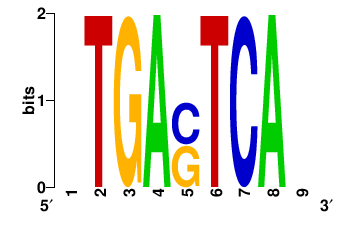

.. _`api`:

API documentation
=================

.. toctree::
    :maxdepth: 2

    api

Examples
========

You can follow the interactive API example documentation in a Juypyter notebook using mybinder: 

.. image:: https://mybinder.org/badge_logo.svg 
    :target: https://mybinder.org/v2/gh/vanheeringen-lab/gimmemotifs/develop?filepath=docs/api_examples.ipynb

Working with motifs
-------------------

The Motif class stores motif information. 
There are several ways to create a Motif instance.

.. code-block:: python

    from gimmemotifs.motif import Motif,read_motifs

    # Read from file
    motifs = read_motifs("example.pfm")

    for motif in motifs:
        print(motif)

::

    AP1_nTGAGTCAy
    CTCF_CCAsyAGrkGGCr

.. code-block:: python

    # Create from scratch
    m = Motif([[0,1,0,0],[0,0,1,0]])
    m.id = "CpG"
    print(m)

::

    CpG_CG

.. code-block:: python

    # Or from a consensus sequence
    from gimmemotifs.motif import motif_from_consensus
    ap1 = motif_from_consensus("TGASTCA")
    print(ap1.to_pwm())

::
    
    >TGASTCA
    0.0001  0.0001  0.0001  0.9998
    0.0001  0.0001  0.9998  0.0001
    0.9998  0.0001  0.0001  0.0001
    0.0001  0.4999  0.4999  0.0001
    0.0001  0.0001  0.0001  0.9998
    0.0001  0.9998  0.0001  0.0001
    0.9998  0.0001  0.0001  0.0001

Read motifs from files in other formats.

.. code-block:: python

    motifs = read_motifs("MA0099.3.jaspar", fmt="jaspar")
    print(motifs[0])        

You can convert a motif to several formats.

.. code-block:: python

    motifs = read_motifs("example.pfm")

    # pwm
    print(motifs[0].to_pwm())   

:: 

    >AP1
    0.5558	0.1469	0.2734	0.0240
    0.0020	0.0015	0.0017	0.9948
    0.0039	0.0019	0.9502	0.0439
    0.9697	0.0220	0.0018	0.0065
    0.0377	0.3311	0.6030	0.0283
    0.0033	0.0031	0.0043	0.9893
    0.0188	0.9775	0.0023	0.0014
    0.9951	0.0021	0.0012	0.0015
    0.0121	0.3096	0.1221	0.5561

    
.. code-block:: python

    # pfm
    print(motifs[0].to_pfm())

::

    >AP1
    555.8	146.9	273.4	24.0
    2.0	1.5	1.7	994.8000000000001
    3.9	1.9	950.2	43.9
    969.7	22.0	1.8	6.5
    37.699999999999996	331.1	603.0	28.299999999999997
    3.3	3.1	4.3	989.3
    18.8	977.5	2.3	1.4
    995.1	2.1	1.2	1.5
    12.1	309.59999999999997	122.1	556.1

.. code-block:: python

    # consensus sequence
    print(motifs[0].to_consensus())

::

    ATGAsTCAy

.. code-block:: python

    # TRANSFAC
    print(motifs[0].to_transfac())

::

    DE	AP1	unknown
    0	555	146	273	24	A
    1	2	1	1	994	T
    2	3	1	950	43	G
    3	969	22	1	6	A
    4	37	331	603	28	s
    5	3	3	4	989	T
    6	18	977	2	1	C
    7	995	2	1	1	A
    8	12	309	122	556	y
    XX

.. code-block:: python

    # MEME
    print(motifs[0].to_meme())

::

    MOTIF AP1
    BL   MOTIF AP1 width=0 seqs=0
    letter-probability matrix: alength= 4 w= 9 nsites= 1000.1 E= 0
    0.5558	0.1469	0.2734	0.024
    0.002	0.0015	0.0017	0.9948
    0.0039	0.0019	0.9502	0.0439
    0.9697	0.022	0.0018	0.0065
    0.0377	0.3311	0.603	0.0283
    0.0033	0.0031	0.0043	0.9893
    0.0188	0.9775	0.0023	0.0014
    0.9951	0.0021	0.0012	0.0015
    0.0121	0.3096	0.1221	0.5561

Some other useful tidbits.
    
.. code-block:: python

    m = motif_from_consensus("NTGASTCAN")
    print(len(m))

::

    9

.. code-block:: python

    # Trim by information content
    m.trim(0.5)
    print(m.to_consensus(), len(m))

::

    TGAsTCA 7

.. code-block:: python
    
    # Slices
    print(m[:3].to_consensus())
    
::

    TGA

.. code-block:: python
    
    # Shuffle
    random_motif = motif_from_consensus("NTGASTGAN").randomize()
    print(random_motif)

::

    random_snCTAGTAn

To convert a motif to an image, use ``plot_logo()``.
Many different file formats are supported, such as png, svg and pdf.

.. code-block:: python

    m = motif_from_consensus("NTGASTCAN")
    m.plot_logo(fname="ap1.png")

Motif scanning
--------------

For very simple scanning, you can just use a Motif instance. 
Let's say we have a FASTA file called ``test.fa`` that looks like this:

::

    >seq1
    AAAAAAAAAAAAAAAAAAAAAA
    >seq2
    CGCGCGTGAGTCACGCGCGCGCG
    
    TGASTCAAAAAAAAAATGASTCA

Now we can use this file for scanning.

.. code-block:: python
    
    from gimmemotifs.motif import motif_from_consensus
    from gimmemotifs.fasta import Fasta
    
    f = Fasta("test.fa")
    m = motif_from_consensus("TGAsTCA")

    m.pwm_scan(f)

::

    {'seq1': [], 'seq2': [6, 6], 'seq3': [0, 16, 0, 16]}

This return a dictionary with the sequence names as keys. 
The value is a list with positions where the motif matches. 
Here, as the AP1 motif is a palindrome, you see matches on both forward and reverse strand. 
This is more clear when we use ``pwm_scan_all()`` that returns position, score and strand for every match.

.. code-block:: python

    m.pwm_scan_all(f)

::

    {'seq1': [],
     'seq2': [(6, 9.02922042678255, 1), (6, 9.02922042678255, -1)],
     'seq3': [(0, 8.331251500673487, 1),
     (16, 8.331251500673487, 1),
     (0, 8.331251500673487, -1),
     (16, 8.331251500673487, -1)]}

The number of matches to return is set to 50 by default, you can control this by setting the ``nreport`` argument. 
Use ``scan_rc=False`` to only scan the forward orientation.

.. code-block:: python

    m.pwm_scan_all(f, nreport=1, scan_rc=False)
    
::

    {'seq1': [],
     'seq2': [(6, 9.02922042678255, 1)],
     'seq3': [(0, 8.331251500673487, 1)]}

While this functionality works, it is not very efficient. 
To scan many motifs in potentially many sequences, use the functionality in the ``scanner`` module.
If you only want the best match per sequence, is a utility function called ``scan_to_best_match``, otherwise, use the ``Scanner`` class.

.. code-block:: python

    
    from gimmemotifs.motif import motif_from_consensus
    from gimmemotifs.scanner import scan_to_best_match
    
    m1 = motif_from_consensus("TGAsTCA")
    m1.id = "AP1"
    m2 = motif_from_consensus("CGCG")
    m2.id = "CG"
    motifs = [m1, m2]

    print("motif\tpos\tscore")
    result = scan_to_best_match("test.fa", motifs)
    for motif, matches in result.items():
        for match in matches:
            print("{}\t{}\t{}".format(motif, match[1], match[0]))
    
::

    motif       pos     score
    CG  0       -18.26379789133924
    CG  0       5.554366880674296
    CG  0       -7.743307225501047
    AP1 0       -20.052563923836903
    AP1 6       9.029486018303187
    AP1 0       8.331550321011443

The matches are in the same order as the sequences in the original file.

While this function can be very useful, a ``Scanner`` instance is much more flexible. 
You can scan different input formats (BED, FASTA, regions), and control the thresholds and output.

As an example we will use the file ``Gm12878.CTCF.top500.w200.fa`` that contains 500 top CTCF peaks.
We will get the CTCF motif and scan this file in a number of different ways.

.. code-block:: python

    from gimmemotifs.motif import read_motifs
    from gimmemotifs.scanner import Scanner
    from gimmemotifs.fasta import Fasta
    import numpy as np

    # Input file
    fname = "Gm12878.CTCF.top500.w200.fa"

    # Select the CTCF motif from the default motif database
    motifs = [m for m in read_motifs() if "CTCF" in m.factors['direct']][:1]

    # Initialize the scanner
    s = Scanner()
    s.set_motifs(motifs)

Now let's get the best score for the CTCF motif for each sequence.

.. code-block:: python

    scores = [r[0] for r in s.best_score("examples/Gm12878.CTCF.top500.w200.fa")]
    print("{}\t{:.2f}\t{:.2f}\t{:.2f}".format(
        len(scores), 
        np.mean(scores), 
        np.min(scores), 
        np.max(scores)
        ))
    
::

    500	11.00	1.45	15.07

In many cases you'll want to set a threshold. 
In this example we'll use a 1% FPR threshold, based on scanning randomly selected sequences from the ghg38 genome.
The first time you run this, it will take a while. 
However, the tresholds will be cached. 
This means that for the same combination of motifs and genome, the previously generated threshold will be used.

.. code-block:: python

    # Set a 1% FPR threshold based on random hg38 sequence
    s.set_genome("hg38")
    s.set_threshold(fpr=0.01)

    # get the number of sequences with at least one match
    counts = [n[0] for n in s.count("Gm12878.CTCF.top500.w200.fa", nreport=1)]
    print(counts[:10])

::

    [1, 1, 1, 1, 1, 1, 1, 1, 1, 1]

.. code-block:: python

    # or the grand total of number of sequences with 1 match
    print(s.total_count("examples/Gm12878.CTCF.top500.w200.fa", nreport=1))

::

    [404]

.. code-block:: python

    # Scanner.scan() just gives all information
    seqs = Fasta("Gm12878.CTCF.top500.w200.fa")[:10]
    for i,result in enumerate(s.scan(seqs)):
        seqname = seqs.ids[i]
        for m,matches in enumerate(result):
            motif = motifs[m]
            for score, pos, strand in matches:
                print(seqname, motif, score, pos, strand)
::

    chr11:190037-190237 C2H2_ZF_Average_200_CCAsyAGrkGGCr 13.4959558370929 143 -1
    chr11:190037-190237 C2H2_ZF_Average_200_CCAsyAGrkGGCr 10.821440417077262 22 -1
    chr11:190037-190237 C2H2_ZF_Average_200_CCAsyAGrkGGCr 10.658439190070851 82 -1
    chr14:106873577-106873777 C2H2_ZF_Average_200_CCAsyAGrkGGCr 14.16061638444734 120 -1
    chr14:106873577-106873777 C2H2_ZF_Average_200_CCAsyAGrkGGCr 13.72460285196088 83 -1
    chr14:106873577-106873777 C2H2_ZF_Average_200_CCAsyAGrkGGCr 11.450778540447134 27 -1
    chr14:106873577-106873777 C2H2_ZF_Average_200_CCAsyAGrkGGCr 10.037330832055455 7 -1
    chr14:106873577-106873777 C2H2_ZF_Average_200_CCAsyAGrkGGCr 8.998038360035828 159 -1
    chr14:106873577-106873777 C2H2_ZF_Average_200_CCAsyAGrkGGCr 8.668660161058972 101 -1
    chr14:106765204-106765404 C2H2_ZF_Average_200_CCAsyAGrkGGCr 14.16061638444734 145 -1
    chr14:106765204-106765404 C2H2_ZF_Average_200_CCAsyAGrkGGCr 13.848270770440264 185 -1
    chr14:106765204-106765404 C2H2_ZF_Average_200_CCAsyAGrkGGCr 13.668171128367552 165 -1
    chr14:106765204-106765404 C2H2_ZF_Average_200_CCAsyAGrkGGCr 12.785329839873164 27 -1
    chr14:106765204-106765404 C2H2_ZF_Average_200_CCAsyAGrkGGCr 11.886792072933595 126 -1
    chr14:106765204-106765404 C2H2_ZF_Average_200_CCAsyAGrkGGCr 11.25063146496227 67 -1
    chr15:22461178-22461378 C2H2_ZF_Average_200_CCAsyAGrkGGCr 14.16061638444734 28 -1
    chr15:22461178-22461378 C2H2_ZF_Average_200_CCAsyAGrkGGCr 14.16061638444734 185 -1
    chr15:22461178-22461378 C2H2_ZF_Average_200_CCAsyAGrkGGCr 13.261096435278661 67 -1
    chr15:22461178-22461378 C2H2_ZF_Average_200_CCAsyAGrkGGCr 11.450778540447134 147 -1
    chr15:22461178-22461378 C2H2_ZF_Average_200_CCAsyAGrkGGCr 11.022594547749485 126 -1
    chr15:22461178-22461378 C2H2_ZF_Average_200_CCAsyAGrkGGCr 10.194691222675097 7 -1
    chr14:107119996-107120196 C2H2_ZF_Average_200_CCAsyAGrkGGCr 11.886792072933595 37 -1
    chr14:107119996-107120196 C2H2_ZF_Average_200_CCAsyAGrkGGCr 11.886792072933595 95 -1
    chr14:107119996-107120196 C2H2_ZF_Average_200_CCAsyAGrkGGCr 11.886792072933595 153 -1
    chr14:107119996-107120196 C2H2_ZF_Average_200_CCAsyAGrkGGCr 9.972530270193543 75 -1
    chr14:107119996-107120196 C2H2_ZF_Average_200_CCAsyAGrkGGCr 9.949273408029276 17 -1
    chr14:107119996-107120196 C2H2_ZF_Average_200_CCAsyAGrkGGCr 9.949273408029276 133 -1
    chr14:107238917-107239117 C2H2_ZF_Average_200_CCAsyAGrkGGCr 14.16061638444734 92 -1
    chr14:107238917-107239117 C2H2_ZF_Average_200_CCAsyAGrkGGCr 11.25063146496227 34 -1
    chr14:107238917-107239117 C2H2_ZF_Average_200_CCAsyAGrkGGCr 9.246743494108388 15 -1
    chr6:53036754-53036954 C2H2_ZF_Average_200_CCAsyAGrkGGCr 8.764279993851783 62 1
    chr14:107147705-107147905 C2H2_ZF_Average_200_CCAsyAGrkGGCr 13.697109967765122 33 -1
    chr14:107147705-107147905 C2H2_ZF_Average_200_CCAsyAGrkGGCr 13.204664711685334 149 -1
    chr14:107147705-107147905 C2H2_ZF_Average_200_CCAsyAGrkGGCr 11.222131525579154 92 -1
    chr14:107147705-107147905 C2H2_ZF_Average_200_CCAsyAGrkGGCr 11.222131525579154 130 -1
    chr14:50328834-50329034 C2H2_ZF_Average_200_CCAsyAGrkGGCr 11.148765667117496 133 1
    chr1:114889205-114889405 C2H2_ZF_Average_200_CCAsyAGrkGGCr 9.752478102244137 124 1

.. _`api documentation`:

Finding de novo motifs
----------------------

Let's take the ``Gm12878.CTCF.top500.w200.fa`` file as example again. 
For a basic example we'll just use two motif finders, as they're quick to run.

.. code-block:: python

    from gimmemotifs.denovo import gimme_motifs

    peaks = "Gm12878.CTCF.top500.w200.fa"
    outdir = "CTCF.gimme"
    params = {
        "tools": "Homer,BioProspector",
        }

    motifs = gimme_motifs(peaks, outdir, params=params)

::

    2017-06-30 07:37:00,079 - INFO - starting full motif analysis
    2017-06-30 07:37:00,082 - INFO - preparing input (FASTA)
    2017-06-30 07:37:32,949 - INFO - starting motif prediction (medium)
    2017-06-30 07:37:32,949 - INFO - tools: BioProspector, Homer
    2017-06-30 07:37:40,540 - INFO - BioProspector_width_5 finished, found 5 motifs
    2017-06-30 07:37:41,308 - INFO - BioProspector_width_7 finished, found 5 motifs
    2017-06-30 07:37:41,609 - INFO - BioProspector_width_6 finished, found 5 motifs
    2017-06-30 07:37:42,003 - INFO - BioProspector_width_8 finished, found 5 motifs
    2017-06-30 07:37:44,054 - INFO - Homer_width_5 finished, found 5 motifs
    2017-06-30 07:37:45,201 - INFO - Homer_width_6 finished, found 5 motifs
    2017-06-30 07:37:48,246 - INFO - Homer_width_7 finished, found 5 motifs
    2017-06-30 07:37:50,503 - INFO - Homer_width_8 finished, found 5 motifs
    2017-06-30 07:37:54,649 - INFO - BioProspector_width_9 finished, found 5 motifs
    2017-06-30 07:37:56,169 - INFO - BioProspector_width_10 finished, found 5 motifs
    2017-06-30 07:37:56,656 - INFO - Homer_width_9 finished, found 5 motifs
    2017-06-30 07:37:59,313 - INFO - Homer_width_10 finished, found 5 motifs
    2017-06-30 07:37:59,314 - INFO - all jobs submitted
    2017-06-30 07:39:21,298 - INFO - predicted 60 motifs
    2017-06-30 07:39:21,326 - INFO - 53 motifs are significant
    2017-06-30 07:39:21,410 - INFO - clustering significant motifs.
    2017-06-30 07:39:47,031 - INFO - creating reports
    2017-06-30 07:40:41,024 - INFO - finished
    2017-06-30 07:40:41,024 - INFO - output dir: CTCF.gimme
    2017-06-30 07:40:41,024 - INFO - report: CTCF.gimme/motif_report.html

This will basically run the same pipeline as the ``gimme motifs`` command.
All output files will be stored in ``outdir`` and ``gimme_motifs`` returns a list of Motif instances.
If you only need the motifs but not the graphical report, you can decide to skip it by setting ``create_report`` to ``False``.
Additionally, you can choose to skip clustering (``cluster=False``) or to skip calculation of significance (``filter_significant=False``). 
For instance, the following command will only predict motifs and cluster them.

.. code-block:: python

    motifs = gimme_motifs(peaks, outdir,
        params=params, filter_significant=False, create_report=False)

All parameters for motif finding are set by the ``params`` argument. 

Although the ``gimme_motifs()`` function is probably the easiest way to run the de novo finding tools, you can also run any of the tools directly. In this case you would also have to supply the background file if the specific tool requires it.

.. code-block:: python

    from gimmemotifs.tools import get_tool
    from gimmemotifs.background import MatchedGcFasta

    m = get_tool("homer")  # tool name is case-insensitive

    # Create a background fasta file with a similar GC%
    fa = MatchedGcFasta("TAp73alpha.fa", number=1000)
    fa.writefasta("bg.fa")

    # Run motif prediction
    params = {
        "background": "bg.fa",
        "width": "20",
        "number": 5,
    }

    motifs, stdout, stderr = m.run("TAp73alpha.fa", params=params)
    print(motifs[0].to_consensus())

::

    nnnCnTGynnnGrCwTGyyn

Motif statistics
----------------

With some motifs, a sample file and a background file you can calculate motif statistics.
Let's say I wanted to know which of the p53-family motifs is most enriched in the file ``TAp73alpha.fa``. 

First, we'll generate a GC%-matched genomic background. 
Then we only select p53 motifs.

.. code-block:: python

    from gimmemotifs.background import MatchedGcFasta
    from gimmemotifs.fasta import Fasta
    from gimmemotifs.stats import calc_stats
    from gimmemotifs.motif import default_motifs

    sample = "TAp73alpha.fa"
    bg = MatchedGcFasta(sample, genome="hg19", number=1000)

    motifs = [m for m in default_motifs() if any(f in m.factors['direct'] for f in ["TP53", "TP63", "TP73"])]

    stats = calc_stats(motifs=motifs, fg_file=sample, bg_file=bg, genome="hg19")

    print("Stats for", motifs[0])
    for k, v in stats[str(motifs[0])].items():
        print(k,v)

    print()

    best_motif = sorted(motifs, key=lambda x: stats[str(x)]["recall_at_fdr"])[-1]
    print("Best motif (recall at 10% FDR):", best_motif)
        

::

    Stats for GM.5.0.p53.0001_rCATGyCCnGrCATGy
    recall_at_fdr 0.833
    fraction_fpr 0.416
    score_at_fpr 9.05025905735
    enr_at_fpr 41.6
    max_enrichment 55.5
    phyper_at_fpr 3.33220067463e-132
    mncp 1.85474606318
    roc_auc 0.9211925
    roc_auc_xlim 0.0680115
    pr_auc 0.927368602993
    max_fmeasure 0.867519181586
    ks_pvalue 0.0
    ks_significance inf

    Best motif (recall at 10% FDR): GM.5.0.p53.0001_rCATGyCCnGrCATGy
    

A lot of statistics are generated and you will not always need all of them. 
You can choose one or more specific metrics with the additional ``stats`` argument.

.. code-block:: python

    metrics = ["roc_auc", "recall_at_fdr"]
    stats = calc_stats(motifs=motifs, fg_file=sample, bg_file=bg, stats=metrics, genome="hg19")

    for metric in metrics:
        for motif in motifs:
            print("{}\t{}\t{:.2f}".format(
                motif.id, metric, stats[str(motif)][metric]
                ))
    

::

    p53_M5923_1.01        roc_auc 0.63
    p53_M5922_1.01 roc_auc 0.64
    p53_Average_10  roc_auc 0.83
    p53_Average_8   roc_auc 0.93
    p53_M3568_1.01  roc_auc 0.83
    p53_M5923_1.01  recall_at_fdr   0.00
    p53_M5922_1.01  recall_at_fdr   0.00
    p53_Average_10  recall_at_fdr   0.24
    p53_Average_8   recall_at_fdr   0.83
    p53_M3568_1.01  recall_at_fdr   0.42

Motif comparison
----------------

Compare two motifs.

.. code-block:: python

    from gimmemotifs.comparison import MotifComparer
    from gimmemotifs.motif import motif_from_consensus
    from gimmemotifs.motif import read_motifs
    m1 = motif_from_consensus("RRRCATGYYY")
    m2 = motif_from_consensus("TCRTGT")

    mc = MotifComparer()
    score, pos, orient = mc.compare_motifs(m1, m2)

    if orient == -1:
        m2 = m2.rc()
    pad1, pad2 = "", ""
    if pos < 0:
        pad1 = " " * -pos 
    elif pos > 0:
        pad2 =" " * pos
    print(pad1 + m1.to_consensus())
    print(pad2 + m2.to_consensus())

::

    rrrCATGyyy
      ACAyGA

Find closest match in a motif database.

.. code-block:: python

    motifs = [
        motif_from_consensus("GATA"),
        motif_from_consensus("NTATAWA"),
        motif_from_consensus("ACGCG"),
    ]

    mc = MotifComparer()
    results = mc.get_closest_match(motifs, dbmotifs=read_motifs("HOMER"), metric="seqcor")

    # Load motifs
    db = read_motifs("HOMER", as_dict=True)

    for motif in motifs:
        match, scores = results[motif.id]
        print("{}: {} - {:.3f}".format(motif.id, match, scores[0]))
        dbmotif = db[match]
        orient = scores[2]
        if orient == -1:
            dbmotif = dbmotif.rc()
        padm, padd = 0, 0
        if scores[1] < 0:
            padm = -scores[1]
        elif scores[1] > 0:
            padd = scores[1]
        print(" " * padm + motif.to_consensus())
        print(" " * padd + dbmotif.to_consensus())
        print()

::

    GATA: AGATAASR_GATA3(Zf)/iTreg-Gata3-ChIP-Seq(GSE20898)/Homer - 0.823
     GATA
    AGATAAnr

    NTATAWA: NGYCATAAAWCH_CDX4(Homeobox)/ZebrafishEmbryos-Cdx4.Myc-ChIP-Seq(GSE48254)/Homer - 0.747
      nTATAwA
    nnynrTAAAnnn

    ACGCG: NCCACGTG_c-Myc(bHLH)/LNCAP-cMyc-ChIP-Seq(Unpublished)/Homer - 0.744
     ACGCG
    CACGTGGn

Auto-generated
==============

This part of the API documentation is not yet complete.

The Motif class
---------------

.. automodule:: gimmemotifs.motif
   :members:

Prediction of de novo motifs
----------------------------

.. automodule:: gimmemotifs.denovo
   :members:

Motif scanning
--------------

.. automodule:: gimmemotifs.scanner
   :members:

Maelstrom
---------

.. automodule:: gimmemotifs.maelstrom
   :members:

Motif activity prediction
-------------------------

.. automodule:: gimmemotifs.moap
   :members:

Motif statistics
----------------

.. automodule:: gimmemotifs.stats
   :members: 

Motif comparison
----------------

.. automodule:: gimmemotifs.comparison
   :members: 
