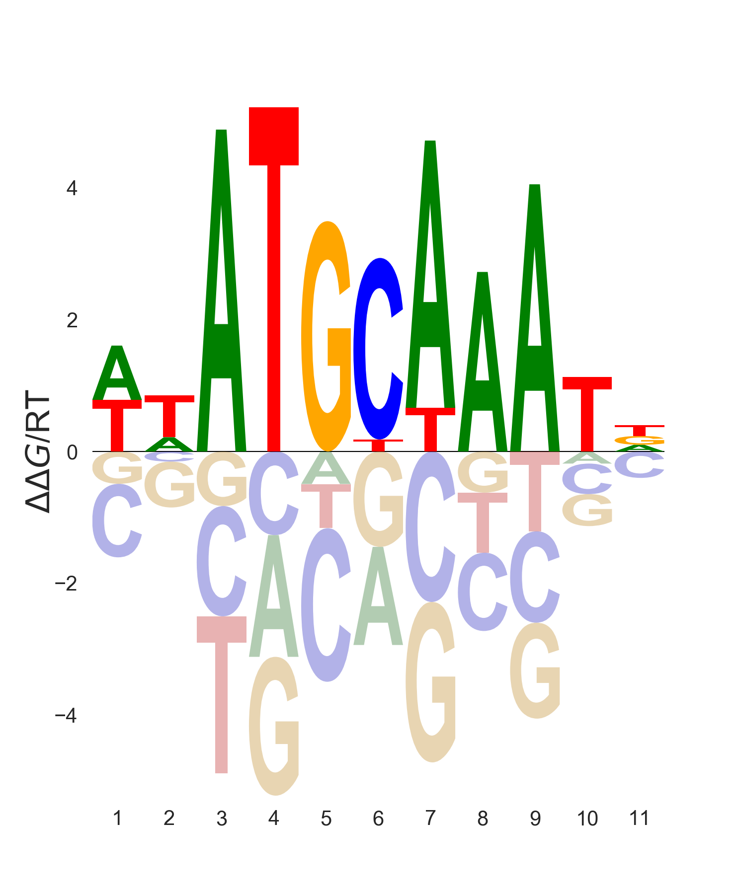

.. _`command-line`:

Command-line reference
======================

In addition to ``gimme motifs`` the GimmeMotifs package contains
several other tools that can perform the various substeps of
GimmeMotifs, as well as other useful tools. Run them to see the options.

List of tools
-------------

* :ref:`gimme motifs<gimme_motifs>`
* :ref:`gimme scan<gimme_scan>`
* :ref:`gimme maelstrom<gimme_maelstrom>`
* :ref:`gimme background<gimme_background>`
* :ref:`gimme logo<gimme_logo>`
* :ref:`gimme match<gimme_match>`
* :ref:`gimme cluster<gimme_cluster>`
* :ref:`gimme threshold<gimme_threshold>`
* :ref:`gimme location<gimme_location>`
* :ref:`gimme diff<gimme_diff>`

Input formats
-------------

Most tools in this section take a file in PFM format as input. This is
actually a file with Position Specific Scoring Matrices (PSSMs)
containing *frequencies*. It looks like this:

::

    >motif1
    0.3611  0.0769  0.4003  0.1664
    0.2716  0.0283  0.5667  0.1381
    0.6358  0.0016  0.3344  0.0330
    0.0016  0.9859  0.0016  0.0157
    0.8085  0.0063  0.0502  0.1397
    >motif2
    0.2276  0.0157  0.0330  0.7284
    0.0031  0.0016  0.9984  0.0016
    0.0377  0.3799  0.0016  0.5856
    0.0816  0.7096  0.0173  0.1962
    0.1350  0.4035  0.0675  0.3987

The frequencies are separated by tabs, and in the order A,C,G,T.

.. _`gimme_motifs`:

Command: gimme motifs
---------------------

The ``gimme motifs`` command can be used for known and/or *de novo* motif analysis.
By default it runs both.

Quick example of *de novo* motif analysis
~~~~~~~~~~~~~~~~~~~~~~~~~~~~~~~~~~~~~~~~~

You can try GimmeMotifs with a small example dataset included in the
examples directory, included with GimmeMotifs. This example does not
require any additional configuration if GimmeMotifs is installed
correctly.

Change to a directory where you have write permissions and run the
following command (substitute the filename with the location of the file
on your system):

::

    gimme motifs /usr/share/gimmemotifs/examples/TAp73alpha.fa p73 --denovo -g hg19

The first argument is the name of the input file and the second argument 
defines the name of the output directory that is created. All output files 
are stored in this directory. The genome is set to the ``hg38`` genome. This 
requires you to have installed ``hg38`` using  `genomepy <https://github.com/simonvh/genomepy>`_. Alternatively, you
can also supply the path to a genome FASTA file with the ``-g`` option.

Depending on your computer, this analysis will take around 15-20 minutes. 
By default, the 
`three top-performing <https://www.biorxiv.org/content/10.1101/474403v1>`_
*de novo* motif tools will be used: MEME, Homer and BioProspector.
Once GimmeMotifs is finished you can open
`p73/p73\_motif\_report.html <p73/p73_motif_report.html>`_ in your
browser.

You can also run the same analysis with a BED file or narrowPeak file as input, or a text 
file with regions in ``chrom:start-end`` format

Best practices and tips
~~~~~~~~~~~~~~~~~~~~~~~

GimmeMotifs is multi-threaded
+++++++++++++++++++++++++++++

GimmeMotifs runs multi-threaded and by default uses 12 threads. All the 
*de novo* programs will be run in parallel as much as possible. Of 
course some programs are still single-threaded, and will not really 
benefit from multithreading. You can change the number of threads that
are used using the ``-N`` parameter.

Running time
++++++++++++

The running time of the *de novo* part of GimmeMotifs largely depends 
on three factors:

- the size of the input dataset;
- the motif prediction tools you use;
- the size of the motifs to be identified.

**Size of input dataset**

While GimmeMotifs is developed specifically for ChIP-seq datasets, most
motif prediction tools are not. In practice this means that it does not
make much sense to predict motifs on a large amount of sequences, as
this will usually not result in higher quality motifs. Therefore
GimmeMotifs uses an absolute limit for the prediction set. By default
20% of the sequences are used as input for motif prediction, but with an
absolute maximum. This is controlled by the ``abs_max`` parameter in the
configuration file, which is set to 1000 by default. In general, if you
have a large amount of peaks, you can also consider to run GimmeMotifs
on the top sequences of your input, for instance the 5000 highest peaks.

**Motif prediction tools**

By default, ``gimme motifs`` uses three *de novo* motif prediction tools:
MEME, BioProspector and Homer. These we found to be the best performing
programs for ChIP-seq data (`Bruse & van Heeringen, 2018 <https://www.biorxiv.org/content/10.1101/474403v1.full>`_).
You can include a large variety of other tools by using the ``-t``
parameter. This will result in an increased running time and some tools, 
such as GADEM, will take a very long time.
The following tools are supported:

- `AMD <https://dx.doi.org/10.1371%2Fjournal.pone.0024576>`_
- `BioProspector <http://ai.stanford.edu/~xsliu/BioProspector/>`_
- `ChIPMunk <http://autosome.ru/ChIPMunk/>`_
- `DiNAMO <https://github.com/bonsai-team/DiNAMO>`_
- `GADEM <https://dx.doi.org/10.1089%2Fcmb.2008.16TT>`_
- `DREME <http://meme-suite.org/index.html>`_
- `HMS <https://doi.org/10.1093/nar/gkr1135>`_
- `Homer <http://homer.ucsd.edu/homer/motif/>`_
- `Improbizer <https://doi.org/10.1126/science.1102216>`_
- `MDmodule <http://people.math.umass.edu/~conlon/mr.html>`_
- `MEME <http://meme-suite.org/index.html>`_
- `MotifSampler <http://bioinformatics.intec.ugent.be/MotifSuite/motifsampler.php>`_
- `POSMO <https://dx.doi.org/10.1093%2Fnar%2Fgkr1135>`_
- `ProSampler <https://github.com/zhengchangsulab/ProSampler>`_
- `RPMCMC <http://daweb.ism.ac.jp/yoshidalab/motif/>`_
- `Trawler <https://trawler.erc.monash.edu.au/>`_
- `Weeder <http://159.149.160.51/modtools/>`_
- `XXmotif <https://github.com/soedinglab/xxmotif>`_
- `YAMDA <https://github.com/daquang/YAMDA>`_

With the exception of RPMCMC and YAMDA, all tools come installed with GimmeMotifs 
when using the bioconda package. AMD, HMS, Improbizer, MotifSampler and DiNAMO 
are not supported on OSX.

**Please note:** all these programs include their own license and many are free
**for academic or non-commercial** use only. For commercial use of any of these 
programs, please consult the respective author! GimmeMotifs itself can be freely 
used commercially.

**Motif size**

The default setting for motif size is ``-a xl``, which searches for motifs
with a length of up to 20. You can use different analysis sizes: 
``small`` (up to 8), ``medium`` (up to 10) or ``large`` (up to 14). The 
running time can be significantly shorter for shorter motifs. However, 
keep in mind that the ``xl`` analysis setting results in the best motifs 
in general.

Small input sets
++++++++++++++++

GimmeMotifs is developed for larger datasets, such as ChIP-seq peaks, where
you have the luxury to use a large fraction of your input for
validation. This means that at least several hundred sequences would be optimal. If
you want to run GimmeMotifs on a small input dataset, it might be
worthwile to increase the fraction used for motif prediction with the ``-f``
argument, for instance ``-f 0.5``.

Running on FASTA files
++++++++++++++++++++++

It is possible to run GimmeMotifs on a FASTA file as input instead
of a BED file. This is detected automatically if your inputfile is
correctly formatted according to FASTA specifications. Please note that for 
best results, all the sequences should be of the same length. This is not
necessary for motif prediction, but the statistics and positional
preference plots will be wrong if sequences have different lengths. 

Intermediate results
++++++++++++++++++++

GimmeMotifs produces a lot of intermediate results, such as all
predicted motifs, FASTA files used for validation and so on. These are
deleted by default (as they can get quite large), but if you are
interested in them, you can specify the ``-k`` option.

Detailed options for gimme motifs
+++++++++++++++++++++++++++++++++

**Positional arguments**

-  ``INPUT``

   The inputfile needs to be in BED, FASTA, narrowPeak or region format. 
   By default ``gimme motifs`` will take the center of these features, and extend 
   those to the size specified by the ``-s`` or ``--size`` argument. By default
   this is 200 bp. Keep in mind that the smaller the regions are, the better motif
   discovery will work.
   **BED-fomatted** files need to contain at least three tab-separated columns 
   describing chromosome name, start and end. The fourth column is optional. 
   If it is specified it will be used by some motif prediction tools to sort the
   features before motif prediction. 
   **FASTA** files can be used as input for motif prediction. For best results it
   is recommended to use sequences of the same size.
   Peak files in **narrowPeak** format, such as produced by MACS2, can also
   directly be used as input. With these files, ``gimme motifs`` will use the summit
   of the peak and create regions of size 200 centered at this summit. Use the ``-s``
   parameter to change this size.
   Finally, **region** files can be used. These contain one column, with regions
   specified in ``chrom:start-end`` format.

-  ``OUTDIR``

   The name of the output directory. All output files will be saved in this directory.
   If the directory already exists files will be overwritten.

**Optional arguments**

-  ``-b BACKGROUND``, ``--background BACKGROUND``

   Type of background to use. There are five options: ``gc``, ``genomic``, ``random``, 
   ``promoter`` or the path to file with background sequences (FASTA, BED or regions).
   By default ``gc`` is used, which generates random regions from the genome with a 
   similar GC% as your input sequences. The ``genomic`` background will select random
   genomic regions without taking the sequence composition into account. The ``random``
   background will create artificial sequences with a similar nucleotide distribution
   as your input sequences. The ``promoter`` background will select random promoters. For
   this option, your genome needs to be installed with `genomepy <https://github.com/simonvh/genomepy>`_ using the ``--annotation``
   option. Finally, you can select your own custom background by supplying the path to
   a file.

-  ``-g GENOME``

   Name of the genome to use. This can be the name of a genome installed with `genomepy <https://github.com/simonvh/genomepy>`_
   or the path to a FASTA file.

- ``--denovo``

  Only run *de novo* motif analysis. By default, the analysis includes known motifs. For
  specific arguments for *de novo* motif analysis, see below.

- ``--known``
  
  Only run known motif analysis. By default, the analysis includes *de novo* motifs. For
  specific arguments for known motif analysis, see below.

- ``--noreport``

  Don't create a HTML report, only plain text output files.

- ``--rawscore``

  Don't use z-score normalization for motif scores. The raw logodds motif score are 
  dependent on motif length. This means that the same logodds score will mean different
  things for motifs with a different length. By default, GimmeMotifs uses the scores in 
  a set of genomic background regions to determine the a background distribution of scores.
  The logodds score is then scaled using this distribution.

- ``--nogc``

  By default GimmeMotifs calculates the motif logodds score distribution for regions with
  a different GC%. The score is then normalized according to the GC% bin per input sequence.
  Use this argument to turn this off.

- ``-N INT``, ``--threads INT``

  Number of threads to use (default is 12).

 
**Optional arguments for known motif analysis**

- ``-p PFMFILE``

  PFM file with motifs to use for known motif analysis. You can use a custom PFM file,
  or use any of the databases included with GimmeMotifs such as, for instance,  ``JASPAR2020_vertebrates``,
  ``HOMER``, ``HOCOCOMOv11_HUMAN`` or ``CIS-BP``. By default, a database of clustered 
  vertebrate motifs is used, ``gimme.vertebrate.v5.0``. This database has a limited
  motif redundancy.
  
**Optional arguments for de novo motif analysis**

- ``-t TOOLS``, ``--tools TOOLS``

  The *de novo* motif prediction tools to use, separated by commas. This can be any 
  combination of the following:
  AMD, BioProspector, ChIPMunk, DiNAMO, GADEM, DREME, HMS, Homer, Improbizer, 
  MDmodule, MEME, MEMEW, MotifSampler, POSMO, ProSampler, RPMCMC, Trawler, Weeder,
  XXmotif, YAMDA. By default ``TOOLS`` is ``BioProspector,Homer,MEME``. Note that
  some tools may not be installed. Running ``gimme motifs -h`` will always list
  the tools that are supported on your installation of GimmeMotifs.

-  ``-a``, ``--analysis``

   The size of motifs to look for: small (5-8), medium (5-12), large
   (6-15) or xl (6-20). The larger the motifs, the longer the *de novo* motif prediction
   will take. By default, xl will be used as this generally yields the best motifs.
   However, some prediction tools take a very long time in combination with the xl setting.

- ``k``, ``--keepintermediate``

  Keep intermediate files.

-  ``-s``, ``-–singlestrand``

   Only use the forward strand for prediction. By default both strands are used.

-  ``-f FRACTION``, ``--fraction FRACTION``

   This parameter controls the fraction of the sequences used for
   prediction. This 0.2 by default, so in this case a randomly chosen
   20% of the sequences will be used for prediction. The remaining
   sequences will be used for validation (enrichment, ROC curves etc.).
   If you have a large set of sequences (ie. most ChIP-seq peak sets),
   this is fine. However, if your set is smaller, it might be worthwile
   to increase this prediction fraction. The number of sequences that is used
   is also influenced by the ``abs_max`` parameter in the configuration file.
   Regardless of the ``-f`` parameter, the total number of sequences used
   for motif prediction will never exceed the number specified by ``abs_max``.

-  ``-s N``, ``--size N``

   This is the size of the sequences used for motif prediction. Smaller
   sequences will result in a faster analysis, but you are of course
   limited by the accuracy of your data. For the tested ChIP-seq data
   sets 200 performs fine. If this parameter is set to ``0``, the original size
   of the regions in the input file will be used.

.. _`gimme_maelstrom`:

Command: gimme maelstrom
------------------------

This command can be used to identify differential motifs between two or more data sets. See the :ref:`maelstrom tutorial<maelstrom_tutorial>` for more details.

**Positional arguments:**

:: 

    INPUTFILE             file with regions and clusters
    GENOME                genome
    DIR                   output directory

**Optional arguments:**

::

    -h, --help            show this help message and exit
    -p pfmfile, --pfmfile pfmfile
                          PFM file with motifs (default:
                          gimme.vertebrate.v5.0.pfm)
    --no-filter           Don't remove redundant motifs.
    -F FLOAT, --filter_cutoff FLOAT
                          Cutoff to select non-redundant motifs. Default is 0.8,
                          increase this value to get fewer motifs.
    --nocenter            Don't mean-center the rows by default
    -m NAMES, --methods NAMES
                          Run with specific methods
    -a method, --aggregation method
                          How to combine motifs from individual methods. Default
                          is "int_stouffer", for inverse normal transform of
                          ranks, followed by Stouffer's method to combine
                          z-scores. Alternatively, specify "stuart" for log-
                          transformed rank aggregation p-values.
    -N INT, --nthreads INT
                          Number of threads (default 12)
    --rawscore            Don't z-score normalize motif scores
    --nogc                Don't use GC% bins

**Input file formats**

The input can be in one of two possible formats. 
In both cases the genomic location should be present as ``chrom:start-end`` in the first column.
The first option is a two-column format and looks like this:

::

    loc    cluster
    chr15:49258903-49259103    NK 
    chr10:72370313-72370513    NK 
    chr4:40579259-40579459    Monocytes
    chr10:82225678-82225878    T-cells 
    chr5:134237941-134238141    B-cells 
    chr5:58858731-58858931    B-cells 
    chr20:24941608-24941808    NK 
    chr5:124203116-124203316    NK 
    chr17:40094476-40094676    Erythroblast
    chr17:28659327-28659527    T-cells

This can be the result of a clustering analysis, for instance. 

The second option looks like this:

::

    loc    NK    Monocytes    T-cells    B-cells
    chr12:93507547-93507747    3.118    2.522    1.933    0.197
    chr7:38236460-38236660    1.098    0.502    0.201    0.190
    chr10:21357147-21357347    0.528    -0.066    -1.04    -0.343
    chr6:115521512-115521712    0.406    -0.376    -0.480    -0.667
    chr2:97359808-97360008    1.501    0.905    0.719    0.031
    chr16:16684549-16684749    0.233    -0.362    -0.837    -0.746
    chrX:138964544-138964744    0.330    -0.291    -0.686    -0.777
    chr2:186923973-186924173    0.430    -0.258    -1.164    -0.723
    chrX:113834470-113834670    0.560    -0.036    -0.686    -0.692

This is a tab-separated table, with a header describing the experiments. In case of sequencing data, such 
as ChIP-seq, ATAC-seq or DNaseI seq, we recommend to use **log-transformed** read counts which are
**mean-centered per row**. For optimal results, it is recommended to normalize between experiments (columns) after
 the log-transformatiion step, for instance by quantile normalization or scaling.
By default, ``gimme maelstrom`` will mean-center the input, disable this with ``--nocenter``. 

The second input format generally gives better results than the first one and would be the recommended format.

The output scores of ``gimme maelstrom`` represent the combined result of multiple methods. 
This z-score represents the combined result of multiple methods.
The individual results from different methods are ranked from high-scoring motif to low-scoring motif and converted
to z-scores using the inverse normal transformation. The z-scores from individual methods are then combined using
Stouffer's method. The score that is shown is the aggregated z-score. A higher z-score means that presence of 
the motif or a higher motif score is associated with higher signal in a specific sample.

By default, ``gimme maelstrom`` selects a non-redundant set of motifs by clustering the motifs based on scores in the set of
input sequences. You can disable this by using the ``--no-filter`` argument. You can tweak the number of selected motifs by
changing the ``--filter-cutoff`` parameter. By default this is set to ``0.8``. Increase this value to select fewer motifs, 
decrease it to select more motifs. Keep in mind that you may start to lose biologically relevant motifs if you set this too high.

.. _`gimme_scan`:

Command: gimme scan
-------------------

Scan a set of sequences with a set of motifs, and get the resulting
matches in GFF, BED or table format. 
If the FASTA header includes a chromosome location in ``chrom:start-end`` format, the BED output will return the genomic location of the motif match. 
The GFF file will always have the motif location relative to the input sequence.

A basic command would look like this:

::

    $ gimme scan peaks.bed -g hg38 -b > motifs.bed

The threshold that is used for scanning can be specified in a number of ways.
The default threshold is set to a motif-specific 1% FPR by scanning random genomic sequences.
You can change the FPR with the ``-f`` option and/or the set of sequences that is used to determine the FPR with the ``-B`` option.

For instance, this command would scan with thresholds based on 5% FPR with random genomic mouse sequences. 

:: 

    $ gimme scan input.fa -g mm10 -f 0.05 -b > gimme.scan.bed

And this command would base a 10% FPR on the input file ``hg38.promoters.fa``:

:: 

    $ gimme scan input.fa -f 0.1 -B hg38.promoters.fa -b > gimme.scan.bed

Alternatively, you can specify the threshold as a single score.
This score is relative and is based on the maximum and minimum possible score for each motif. 
For example, a score of 0.95 means that the score of a motif should be at least 95% of the (maximum score - minimum score).
This should probably not be set much lower than 0.8, and should be generally at least 0.9-0.95 for good specificity. 
Generally, as the optimal threshold might be different for each motif, the use of the FPR-based threshold is preferred.
One reason to use a single score as threshold is when you want a match for each motif, regardless of the score. 
This command would give one match for every motif for every sequence, regardless of the score.

:: 

    $ gimme scan input.bed -g hg38 -c 0 -n 1 -b > matches.bed

Finally, ``gimme scan`` can return the scanning results in table format. 
The ``-t`` will yield a table with number of matches, while the ``-T`` will have the score of the best match.

**Positional arguments:**

-  ``INPUT``

   The inputfile needs to be in BED, FASTA or region format. 
   **BED-fomatted** files need to contain at least three tab-separated columns 
   describing chromosome name, start and end. 
   **Region** files can also be used. These contain one column, with regions
   specified in ``chrom:start-end`` format.

**Optional arguments**

-  ``-g GENOME``

   Name of the genome to use. This can be the name of a genome installed with `genomepy <https://github.com/simonvh/genomepy>`_
   or the path to a FASTA file.

- ``-p PFMFILE``, ``--pfmfile PFMFILE``

  PFM file with motifs to use for known motif analysis. You can use a custom PFM file,
  or use any of the databases included with GimmeMotifs such as, for instance,  ``JASPAR2020_vertebrates``,
  ``HOMER``, ``HOCOCOMOv11_HUMAN`` or ``CIS-BP``. By default, a database of clustered 
  vertebrate motifs is used, ``gimme.vertebrate.v5.0``. This database has a limited
  motif redundancy.

- ``-f``, ``--fpr``

  Base the motif score threshold on this FPR. By default this is set to 1%, equivalent to ``-f 0.01``.
  The score threshold is based on scanning random genomic regions with the same size and the same GC% distribution.
  This threshold is calculated once for a specific sequence size and cached. Therefore, scanning will take longer
  the first time you use a specific FPR with a specific input sequence size.

- ``-B``, ``--bgfile``

  Specify a FASTA file to use for FPR calculation, instead of taking random genomic regions.

- ``-c``, ``--cutoff``

  Use this score cutoff instead of an FPR-based threshold. This score is relative and is based on the maximum and minimum possible score for each motif. 
  For example, a score of 0.95 means that the score of a motif should be at least 95% of the (maximum score - minimum score).
  This should probably not be set much lower than 0.8, and should be generally at least 0.9-0.95 for good specificity. 
  Generally, as the optimal threshold might be different for each motif, the use of the FPR-based threshold is preferred.

- ``-n``, ``--nreport``

  Maximum number of matches to report per motif per sequence. By default this is set to 1.

- ``-r``, ``--norc``

  Don't scan the reverse complement of the sequence. By default both strands will be scanned.

- ``-b``, ``--bed``

  Output motif matches in BED format. 

- ``-t``, ``--table``

  Ouput number of matches in a table format, where columns represent motifs and rows represent input sequences.

- ``-T``, ``--score_table``

  Ouput maximum motif score in a table format, where columns represent motifs and rows represent input sequences. The score
  will be reported for each motif, regardless if it is a good match or not.

- ``-z``, ``--zscore``

  Use z-score normalization for motif scores. The raw logodds motif score are 
  dependent on motif length. This means that the same logodds score will mean different
  things for motifs with a different length. By default, GimmeMotifs uses the scores in 
  a set of genomic background regions to determine the a background distribution of scores.
  The logodds score is then scaled using this distribution.

- ``--gc``

  Use this option to calculate the motif logodds score distribution based on regions with
  a similar GC%.
  
- ``-N INT, --threads INT``

  Number of threads to use (default is 12).

.. _`gimme_background`:

Command: gimme background
-------------------------

Generate random sequences according to one of several methods:

- ``random`` - randomly generated sequence with the same dinucleotide distribution as the input sequences according to a 1st order Markov model
- ``genomic`` - sequences randomly chosen from the genome 
- ``gc`` - sequences randomly chosen from the genome with the same GC% as the input sequences
- ``promoter`` - random promoter sequences

The background types ``gc`` and ``random`` need a set of input sequences
in BED or FASTA format. If the input sequences are in BED format, the 
genome version needs to be specified with ``-g``. 

**Positional arguments:**

::

    FILE        outputfile
    TYPE        type of background sequences to generate
                (random,genomic,gc,promoter)

**Optional arguments:**

::

    -h, --help  show this help message and exit
    -i FILE     input sequences (BED or FASTA)
    -f TYPE     output format (BED or FASTA
    -l INT      length of random sequences
    -n NUMBER   number of sequence to generate
    -g GENOME   genome version (not for type 'random')
    -m N        order of the Markov model (only for type 'random', default 1)

.. _`gimme_logo`:

Command: gimme logo
-------------------

Convert one or more motifs in a PFM file to a sequence logo. Most of these logos are made possible by the excellent `Logomaker <https://logomaker.readthedocs.io/en/latest/>`_ package.
You can optionally supply a PFM file, otherwise ``gimme logo`` uses the default ``gimme.vertebrate.v5.0``.
With the ``-i`` option, you can choose one or more motifs to convert.

This will convert all the motifs in ``CTCF.pfm`` to a sequence logo:

:: 

    $ gimme logo -p CTCF.pfm

This will create a logo for ``GM.5.0.Ets.0026`` from the default database.

:: 

    $ gimme logo -i GM.5.0.Ets.0026

You can specify four types of sequence logos:

=========== =================================================
information .. image:: images/MA1115.1_POU5F1.information.png
               :scale: 50 %
frequency   .. image:: images/MA1115.1_POU5F1.frequency.png
               :scale: 50 %
energy      .. image:: images/MA1115.1_POU5F1.energy.png
               :scale: 50 %
ensembl     .. image:: images/MA1115.1_POU5F1.ensembl.png
               :scale: 50 %
=========== =================================================

You can leave the motif title out with the ``--notitle`` argument.

:: 

    $ gimme logo JASPAR2020_vertebrates -i MA1115.1_POU5F1 -k energy --notitle

**Positional arguments:**

- ``pfmfile``
  
  PFM file with motifs. You can use a custom PFM file,
  or use any of the databases included with GimmeMotifs such as, for instance,  ``JASPAR2020_vertebrates``,
  ``HOMER``, ``HOCOCOMOv11_HUMAN`` or ``CIS-BP``.

**Optional arguments:**

- ``-i IDS``, ``--ids IDS``

  Comma-separated list of motif ids (default is all ids).

- ``-k TYPE``, ``--kind TYPE``

  Type of motif (information, frequency, energy or ensembl). The default is information.

- ``--notitle``
   
   Don't include motif ID as title.
     
- ``-h``, ``--help``
   
   Show help message.

.. _`gimme_match`:

Command: gimme match
--------------------

Find the the best match of every motif in a PFM file with input motif(s) to a database of reference motifs.
By default the ``gimme.vertebrate.v5.0`` database is used, however, other databases can be
specified using the ``-d`` argument. This can be a custom PFM file, or any of the databases 
included with GimmeMotifs such as, for instance,  ``JASPAR2020_vertebrates``,  ``HOMER``, ``HOCOCOMOv11_HUMAN`` or ``CIS-BP``. 
If an ouput file is specified, a graphical output with aligned motifs will
be created. However, this is slow for many motifs and can consume a lot of memory 
(`see issue`_).
It works fine for a few motifs at a time.

.. _`see issue`: https://github.com/simonvh/gimmemotifs/issues/5

**Positional arguments:**

::

    PFMFILE     File with input pfms

**Optional arguments:**

::

    -h, --help  show this help message and exit
    -d DBFILE   File with pfms to match against (default:
                gimme.vertebrate.v5.0.pfm)
    -n INT      Number of top matches to report
    -o FILE     Output file with graphical report (png, svg, ps, pdf)

.. _`gimme_cluster`:

Command: gimme cluster
----------------------

Cluster a set of motifs with the WIC metric.

**Positional arguments:**

::

    INPUTFILE     Inputfile (PFM format)
    OUTDIR        Name of output directory

**Optional arguments:**

::

    -h, --help    show this help message and exit
    -s            Don't compare reverse complements of motifs
    -t THRESHOLD  Cluster threshold

.. _`gimme_threshold`:

Command: gimme threshold
------------------------

Create a file with motif-specific thresholds based on a specific background file and a specific FPR. 
The FPR should be specified as a float between 0.0 and 1.0. 
You can use this threshold file with the ``-c`` argument of :ref:`gimme scan<gimme_scan>`.
Note that :ref:`gimme scan<gimme_scan>` by default determines an FPR based on random genomic background sequences.
You can use this command to create the threshold file explicitly, 
or when you want to determine the threshold based on a different type of background.
For instance, this command would create a file with thresholds for the motifs in ``custom.pwm`` with a FPR of 1%, 
based on the sequences in ``promoters.fa``.

:: 

    $ gimme threshold custom.pwm 0.05 promoters.fa > custom.threshold.txt

**Positional arguments:**

::

    PFMFILE     File with pwms
    FAFILE      FASTA file with background sequences
    FPR         Desired fpr

.. _`gimme_location`:

Command: gimme location
-----------------------

Create the positional preference plots for all the motifs in the input
PWM file. This will give best results if all the sequences in the
FASTA-formatted inputfile have the same length. Keep in mind that this
only makes sense if the sequences are centered around a similar feature
(transcription start site, highest point in a peak, etc.). The default
threshold for motif scanning is 0.95, see ``gimme scan`` for more
details.

**Positional arguments:**

::

    PFMFILE     File with pwms
    FAFILE      Fasta formatted file

**Optional arguments:**

::

    -h, --help  show this help message and exit
    -w WIDTH    Set width to W (default: determined from fastafile)
    -i IDS      Comma-separated list of motif ids to plot (default is all ids)
    -c CUTOFF   Cutoff for motif scanning (default 0.95)

.. _`gimme_diff`:

Command: gimme diff
-------------------

This is a simple command to visualize differential motifs between different data sets.
You are probably better of using :ref:`gimme maelstrom<gimme_maelstrom>`, however, in some cases this visualization might still be informative.
The input consists of a number of FASTA files, separated by a comma. These are compared to a background file. 
The last two arguments are a file with pwms and and output image. 
The `gimme diff` command then produces two heatmaps (enrichment and frequency) of all enriched, differential motifs.
Reported motifs are at least 3 times enriched compared to the background (change with the ``-e`` argument) and have a minimum frequency in at least one of the input data sets of 1% (change with the ``-f`` argument).
You can specify motif threshold with the ``-c`` argument (which can be a file generated with :ref:`gimme threshold<gimme_threshold>`).

For a command like this...

::

    $ gimme diff VEGT_specific.summit.200.fa,XBRA_specific.summit.200.fa,XEOMES_specific.summit.200.fa random.w200.fa gimme_diff_tbox.png -p tbox.pwm -f 0.01 -c threshold.0.01.txt 

...the output will look like this (based on ChIP-seq peaks of T-box factors from `Gentsch et al. 2013`_):

.. image:: images/gimme_diff_tbox.png

The image layout is not always optimal. 
If you want to customize the image, you can either save it as a ``.svg`` file, or use the numbers that are printed to stdout. 
The columns are in the same order as the image, the row order may be different as these are clustered before plotting.

Note that the results might differ quite a lot depending on the threshold that is chosen! 
Compare for instance an FPR of 1% vs an FPR of 5%.

.. _`Gentsch et al. 2013`: https://doi.org/10.1016/j.celrep.2013.08.012

**Positional arguments:**

::

    FAFILES               FASTA-formatted inputfiles OR a BED file with an
                          identifier in the 4th column, for instance a cluster
                          number.
    BGFAFILE              FASTA-formatted background file
    PNGFILE               outputfile (image)

**Optional arguments:**

::

    -h, --help            show this help message and exit
    -p PFMFILE, --pfmfile PFMFILE
                          PWM file with motifs (default:
                          gimme.vertebrate.v3.1.pwm)
    -c , --cutoff         motif score cutoff or file with cutoffs (default 0.9)
    -e MINENR, --enrichment MINENR
                          minimum enrichment in at least one of the datasets
                          compared to background
    -f MINFREQ, --frequency MINFREQ
                          minimum frequency in at least one of the datasets
    -g VERSION, --genome VERSION
                          Genome version. Only necessary in combination with a
                          BED file with clusters as inputfile.

