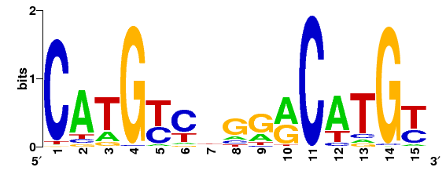
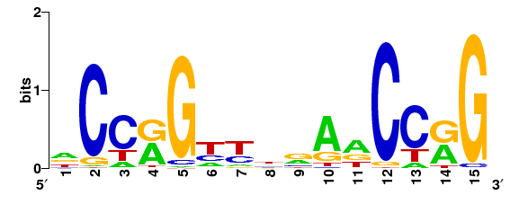

.. _tutorials:

Tutorials
=========

While GimmeMotifs was originally developed to predict *de novo* motifs in ChIP-seq peaks, it is now a full-fledged suite of TF motif analysis tools. 
You can still identify new motifs, but also scan for known motifs, find differential motifs in multiple sets of sequences, create sequence logos, calculate all kinds of enrichment statistics, and more!

For this tutorial I'll assume you use bioconda. 
Create an environment with all the necessary dependencies.

:: 

    $ conda create -n gimme_tutorial gimmemotifs ucsc-bigbedtobed

And activate it!

:: 
    
    $ source activate gimme_tutorial

To locate the example files mentioned in the tutorial, locate the ``examples/`` directory of your GimmeMotifs installation. When using conda:

::

    $  echo `conda info | grep default | awk '{print $4}'`/share/gimmemotifs/examples
    /home/simon/anaconda3/share/gimmemotifs/examples
    $ ls /home/simon/anaconda3/share/gimmemotifs/examples
    TAp73alpha.bed  TAp73alpha.fa

Find de novo motifs
-------------------

As a simple example, let's predict the CTCF motif based on ChIP-seq data from ENCODE.
Download the peaks:

::    

    $ wget http://ftp.ebi.ac.uk/pub/databases/ensembl/encode/integration_data_jan2011/byDataType/peaks/jan2011/spp/optimal/hub/spp.optimal.wgEncodeBroadHistoneGm12878CtcfStdAlnRep0_VS_wgEncodeBroadHistoneGm12878ControlStdAlnRep0.bb

Convert the bigBed file to a BED file using ``bigBedToBed``:

::

    $ bigBedToBed spp.optimal.wgEncodeBroadHistoneGm12878CtcfStdAlnRep0_VS_wgEncodeBroadHistoneGm12878ControlStdAlnRep0.bb Gm12878.CTCF.bed

Select the top 500 peaks, based on the signalValue column of the narrowPeak_ format, as input:

::

    $ sort -k7gr Gm12878.CTCF.bed | awk '{print $1 "\t" $2 + $10 "\t" $2 + $10}' | head -n 500 > Gm12878.CTCF.top500.bed

In addition, we base the location of the peak on the summit (column 10). 
Note the top 500 peaks are just for the tutorial. 
Normally you would use a much larger sample (or all peaks) as input for ``gimme motifs``.

Now, the ENCODE peak coordinates are based on hg19 so we need to install the hg19 genome.
For a UCSC genome, this is just a matter of running ``gimme genome``.

:: 
    
    $ gimme genome /data/genomes/ hg19

I store my genomes in ``/data/genomes`` but you can use any directory you like. 
Also see the section on :ref:`installing genomes<Installing genomes>` below.
This will take some time. 
The genome sequence will be downloaded and indexed, ready for use with GimmeMotifs.

Having both an index genome and an input file, we can run ``gimme motifs``.

:: 

    $ gimme motifs Gm12878.CTCF.top500.bed -g hg19 -n gimme.CTCF

Once again, this will take some time. 
When ``gimme motifs``  is finished you can view the results in a web browser. 
`gimme.CTCF/motif_report.html`_ should look a lot like this.
This is what an almost perfect motif looks like, with a ROC AUC close to 1.0.

.. _`narrowPeak`: https://genome.ucsc.edu/FAQ/FAQformat.html#format12

Scan for known motifs
---------------------

To scan for known motifs, you will need a set of input sequences and a file with motifs. 
By default, ``gimme scan`` uses the motif database that comes included, which is based on clustered, non-redundant motifs from CIS-BP. 
For input sequences you can use either a BED file, a FASTA file or a file with regions in ``chr:start-end`` format. 
You will also need to specify the genome, see the section `Installing genomes`_ below. 
The genome sequence will be used to retrieve sequences, if you have specified a BED or region file, but also to determine a reasonable motif-specific threshold for scanning. 
The default genome can be specified in the configuration file.

We will use the file ``Gm12878.CTCF.top500.bed`` that was used for `de novo` motif search above for known motifs.
While ``gimme motifs`` automatically extends regions from the center of the input regions, ``gimme scan`` uses the regions as specified in the file. 
This means we will have to change the size of the regions to 200 nucleotides. 
Depending on the type and quality of your input data, you can of course make this smaller or larger.

:: 

    $ bedtools slop -i Gm12878.CTCF.top500.bed -b 100 -g hg19.genome > Gm12878.CTCF.top500.w200.bed

OK, let's scan:

::

    $ gimme scan Gm12878.CTCF.top500.w200.bed -g hg19 > result.scan.gff

The first time you run ``gimme scan`` for a specific combination of motif database, genome, input sequence length and FPR (which is 0.01 by default) it will determine a motif-specific cutoff based on random genome background sequences. 
This will take a while. However, results will be cached for future scanning.

To get a BED file with the genomic location of motif matches add the ``-b`` argument:

::

    $ gimme scan Gm12878.CTCF.top500.w200.bed -g hg19 -b > result.scan.bed

By default, ``gimme scan`` gives at most one match per sequence for each motif, if the score of the match reaches a certain threshold.

For a very simple summary, we can just have a look at the most abundant motifs:

:: 

    $ cut -f4 result.scan.bed | sort | uniq -c | sort -n | tail
         50 E2F_Average_31
         58 C2H2_ZF_Average_123
         58 MBD_Average_1
         58 THAP_finger_M1541_1.01
         59 Unknown_Average_5
         67 Ets_Average_70
         72 C2H2_ZF_M0401_1.01
         72 CxxC_M0548_1.01
        118 E2F_Average_27
        394 C2H2_ZF_Average_200

In this case, the most abundant motif is the CTCF motif. 

The specified false positive rate (FPR), with a default of 0.01, determines the motif-specific threshold that is used for scanning.
This means that the expected rate of occurrence, determined by scanning random genomic sequences, is 1%. 
Based on the FPR, you can assume that any motif with more than 1% matches is enriched. 
However, for a more robust measure of motif significance use ``gimme roc``, which is further explained :ref:`below<roc>`.
This command will give the enrichment, but also the ROC AUC and recall at 10% FDR and other useful statistics.

For many applications, it is useful to have motif occurrences as a table. 

:: 

    $ gimme scan Gm12878.CTCF.top500.w200.bed -g hg19 -t > table.count.txt
 
This will result in a tab-separated table with counts. 
Same defaults as above, at most one match per sequence per motif.
Alternatively, ``gimme scan`` can report the score of best match, regardless of the value of this score.

:: 

    $ gimme scan Gm12878.CTCF.top500.w200.bed -g hg19 -T > table.score.txt
    $ head table.score.txt | cut -f1-10
    # GimmeMotifs version 0.10.1b2
    # Input: Gm12878.CTCF.top500.w200.bed
    # Motifs: /home/simon/anaconda3/share/gimmemotifs/motif_databases/gimme.vertebrate.v3.1.pwm
    # FPR: 0.01 (hg19)
            AP-2_Average_26 AP-2_Average_17 AP-2_Average_27 AP-2_Average_15 AP-2_M5965_1.01 ARID_BRIGHT_Average_1   ARID_BRIGHT_M0104_1.01  ARID_BRIGHT_Average_3   ARID_BRIGHT_M5966_1.01
    chr11:190037-190237     3.315682        5.251773        5.852259        6.986044        -0.032952       -1.058302       -4.384525       1.989879        -13.872373
    chr14:106873577-106873777       3.485541        5.315545        3.867055        1.129976        4.386212        -3.305211       -1.392656       2.726421        -13.660561
    chr14:106765204-106765404       3.936576        5.315545        3.867055        1.434064        -1.284617       -1.058302       -3.578581       1.597828        -8.376869
    chr15:22461178-22461378 3.936576        5.315545        3.867055        1.387997        -1.284617       -3.305211       -7.331101       1.551285        -8.929093
    chr14:107119996-107120196       3.485541        5.468490        3.867055        1.434064        4.708942        -5.675314       -7.331101       1.159831        -15.790964

Find differential motifs
------------------------

The ``gimme maelstrom`` command can be used to compare two or more different experiments. 
For instance, ChIP-seq peaks for multiple factors, ChIP-seq peaks of the same factor in different cell lines or tissues, ATAC-seq peaks or expression data.

The input can be in one two possible formats. 
In both cases the genomic location should be present as ``chrom:start-end`` in the first column.
The first option is a two-column format and looks like this:

::

    loc    cluster
    chr15:49258903-49259103    NK 
    chr10:72370313-72370513    NK 
    chr4:40579259-40579459    Monocytes
    chr10:82225678-82225878    T-cells 
    chr5:134237941-134238141    B-cells 
    chr5:58858731-58858931    B-cells 
    chr20:24941608-24941808    NK 
    chr5:124203116-124203316    NK 
    chr17:40094476-40094676    Erythroblast
    chr17:28659327-28659527    T-cells

This can be the result of a clustering analysis, for instance. 

The second option looks like this:

::

    loc    NK    Monocytes    T-cells    B-cells
    chr12:93507547-93507747    3.11846121722    2.52277241968    1.93320358405    0.197177179733
    chr7:38236460-38236660    1.0980120443    0.502311376556    0.200701906431    0.190757068752
    chr10:21357147-21357347    0.528935300354    -0.0669540487727    -1.04367733597    -0.34370315226
    chr6:115521512-115521712    0.406247786632    -0.37661318381    -0.480209252108    -0.667499767004
    chr2:97359808-97360008    1.50162092566    0.905358101064    0.719059595262    0.0313480230265
    chr16:16684549-16684749    0.233838577502    -0.362675820232    -0.837804056065    -0.746483496024
    chrX:138964544-138964744    0.330000689312    -0.29126319574    -0.686082532015    -0.777470189034
    chr2:186923973-186924173    0.430448401897    -0.258029531121    -1.16410548462    -0.723913541425
    chrX:113834470-113834670    0.560122313347    -0.0366707259833    -0.686082532015    -0.692926848415

This is a tab-separated table, with a header describing the experiments. 
The values can be (log-transformed) read counts, expression values or other measurements.

By default, ``gimme maelstrom`` will run in ensemble mode, where it will combine the results from different classification and regression methods and statistical tests through rank aggregation.
The only arguments necessary are the input file, the genome and an output directory.

Here, we will run maelstrom on a dataset that is based on `Corces et al.`_. 
The example file ``hg19.blood.most_variable.1k.txt`` contains normalized ATAC-seq read count data for several hematopoietic cell types: Monocytes, CD4+ and CD8+ T cells, NK cells, B cells and erythrocytes.
This is a subset of the data and contains only the 1000 most variable peaks (highest standard deviation). 
There is also a larger file, that contains more regions ``hg19.blood.most_variable.10k.txt`` and that will also take longer to run.

:: 

    $ gimme maelstrom hg19.blood.most_variable.1k.txt hg19 maelstrom.blood.1k.out

There output directory contains several files:

::
   
    $ ls maelstrom.blood.1k.out
    activity.bayesianridge.score.out.txt            activity.xgboost.score.out.txt
    activity.hypergeom.count.out.txt                final.out.csv
    activity.lasso.score.out.txt                    hg19.blood.most_variable.1k.txt.cluster.txt
    activity.lightningclassification.score.out.txt  motif.count.txt.gz
    activity.lightningregressor.score.out.txt       motif.relevance.png
    activity.mwu.score.out.txt                      motif.score.txt.gz
    activity.rf.score.out.txt

The two motif files, ``motif.count.txt.gz`` and ``motif.score.gz`` contain the motif scan results. 
The ``activity.*.out.txt`` files are tables with the results of the individual methods. 
The main result is ``final.out.csv``, which integrates all individual methods in a final score. 
The following Python snippet will create a heatmap of the results.

.. code-block:: python

   import pandas as pd
   import seaborn as sns
   import numpy as np
   import matplotlib.pyplot as plt

   df = pd.read_table("maelstrom.blood.1k.out/final.out.csv", index_col=0)
   m2f = pd.read_table("/home/simon/git/gimmemotifs/motif_databases/gimme.vertebrate.v3.1.motif2factors.txt", index_col=0)
   m2f.factors = m2f.factors.str.slice(0,50)

   df = df.join(m2f).set_index("factors")
   df = df[["Mono", "CD4", "CD8", "Bcell", "Nkcell", "Ery"]]

   cm = sns.clustermap(df[np.any(abs(df) >= 6, 1)], figsize=(4,15))
   cm.fig.subplots_adjust(right=0.5)
   plt.setp(cm.ax_heatmap.yaxis.get_majorticklabels(), rotation=0);

   plt.savefig("maelstrom.blood.1k.out/heatmap.png")

This will show a heatmap like this:

.. image:: images/heatmap.png

We see that the expected motifs for different cell types are identified. GATA/LMO2 for Erythrocytes, LEF/TCF for T cells (ie. Wnt signaling), EBF1 and PAX5 for B cells and so on. 
The RUNX motif is only identified in CD8+ T cells and not for CD4+ T cells, which recapitulates a known mechanism in CD4- versus CD8-positive T cell differentiation.
It is kind of tricky to get the seaborn clustermap to use reasonable dimensions by default, so play around with the figsize parameter to get it to work.
Keep in mind that this shows only the most relevant motifs (-log10 p-value cutoff of 6), there are more relevant motifs. 
A file with more regions, ``hg19.blood.most_variable.10k.txt`` for this example, will usually yield better results.

.. _`Corces et al.`: https://dx.doi.org/10.1038/ng.3646

Compare two sets with de novo motifs
------------------------------------

gimme motifs

combine: gimme cluster

scan

.. _`Installing genomes`:

Installing genomes
------------------

To use most of the functionality of GimmeMotifs you will need to install a genome. 
Is your genome of interest on UCSC? Then you're in luck. If not, don't despair. 
It's still pretty easy, just a few more steps.

Installing from UCSC: ::

    $ gimme genome /data/genomes/ hg38 
    
This will do several things. First, the `FASTADIR` argument, `/data/genomes` in the example above,
determines where the genome FASTA files will be stored. Be aware that this is the genome `root`
directory. A subdirectory with the genome name will be created here.
The second argument specifies the UCSC genome build. 
In this case, `hg38` is the latest version of the human genome on UCSC.
All the genomes that the UCSC Genome Browser supports sohuld be installable in this way. 
Just a few more examples:

Install the Drosophila genome, in a subdir of my home directory: ::

    $ gimme genome ~/genomes sacCer3
    
Install the zebrafish genome, in the current directory: ::

    $ gimme genome . danRer7
    

Installing a non-UCSC genome: 

* Download the FASTA file
* Create a directory with one sequence per file
* gimme index

.. _roc:

Motif enrichment statistics
---------------------------

You can use ``gimme roc`` to compare motifs or to identify relevant known motifs for a specific input file.

Let's get some known motifs for one of the example files, ``TAp73alpha.fa``. 
First, we need to define a background.
To get random genomic sequences with a matched GC% content:

:: 

    $ gimme background random.gc.fa gc -g hg19 -n 500 -l 200 -i TAp73alpha.fa

This will create a FASTA file with 500 sequences of 200 nucleotides, that has a GC% distribution similar to ``TAp73alpha.fa``.
Now we can run ``gimme roc``:

:: 

    $ gimme roc TAp73alpha.fa random.gc.fa > TAp73alpha.roc.txt

What's in the file?

:: 

    $ head -n 1 TAp73alpha.roc.txt | tr \\t \\n
    Motif
    ROC AUC
    MNCP
    Enr. at 5% FPR
    Max enr.
    Recall at 10% FDR

The motif ID, followed by five statistics: the ROC area under curve (AUC), Mean Normalized Conditional Probability (MNCP), the enrichment compared to background set at 5% FPR, the maximum enrichment and the recall at 10% FDR.

The ROC AUC is widely used, however, it might not always be the most informative.
In situations where the background set is very large compared to the input set, it might give a more optimistic picture than warranted.

Let's sort on the last statistic:

:: 

    $ sort -k6g TAp73alpha.roc.txt | cut -f1,2,6 | tail
    p53_M5923_1.01      0.666   0.1050
    bZIP_M0304_1.01     0.621   0.1240
    Grainyhead_Average_6        0.698   0.1720
    Unknown_M6235_1.01  0.682   0.2330
    bZIP_Average_149    0.620   0.2400
    Myb_SANT_Average_7  0.592   0.2560
    Runt_Average_9      0.709   0.3700
    p53_M3568_1.01      0.823   0.6270
    p53_Average_10      0.825   0.6490
    p53_Average_8       0.918   0.8860

Not surprisingly, the p53 family motif is the most enriched. 
In addition, we also get RUNX1 and AP1 motifs. 
The Grainyhead motif somewhat resembles the p53 motif, which could explain the enrichment. 
Let's visualize this.
This command will create two sequence logos in PNG format:

:: 

    $ gimme logo -i p53_Average_8,Grainyhead_Average_6

The p53 motif, or p73 motif in this case, ``p53_Average_8.png``:

And the Grainyhead motif, ``Grainyhead_Average_6``:

The resemblance is clear. 
This also serves as a warning to never take the results from a computational tool (including mine) at face value...
