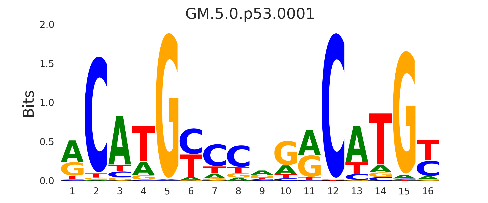
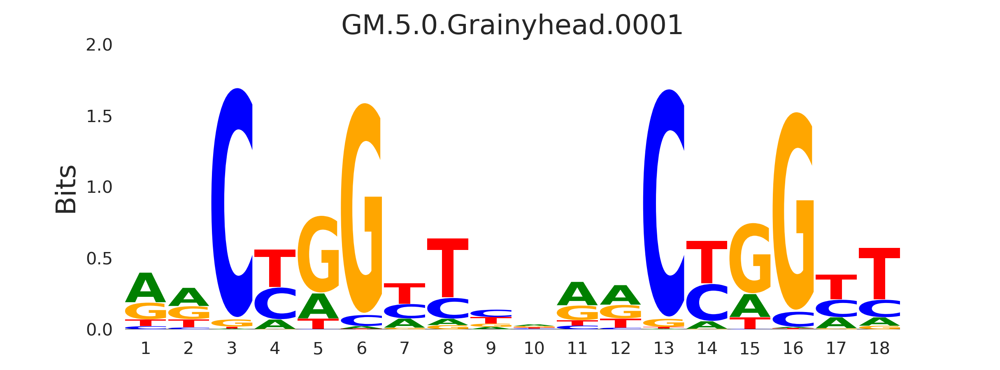
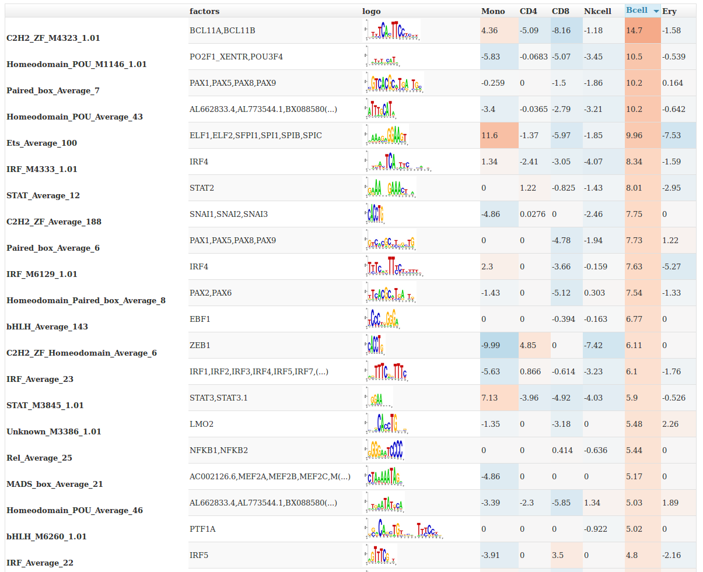
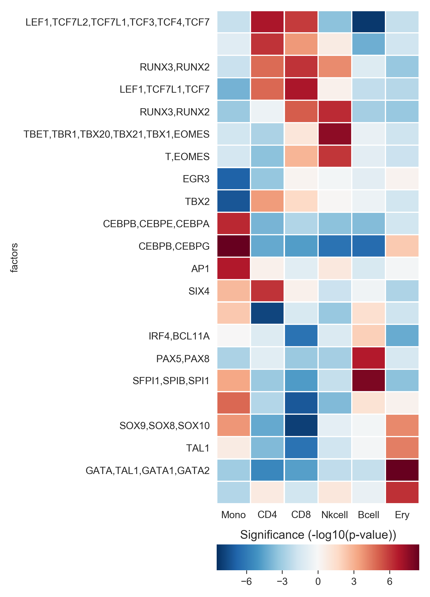

.. _tutorials:

Tutorials
=========

While GimmeMotifs was originally developed to predict *de novo* motifs in ChIP-seq peaks, it is now a full-fledged suite of TF motif analysis tools. 
You can still identify new motifs, but also scan for known motifs, find differential motifs in multiple sets of sequences, create sequence logos, calculate all kinds of enrichment statistics, and more!

For this tutorial I'll assume you use bioconda. 
If you haven't already done so, install GimmeMotifs.

:: 

    $ conda create -n gimme python=3 gimmemotifs

And activate it!

:: 
    
    $ source activate gimme

To locate the example files mentioned in the tutorial, locate the ``examples/`` directory of your GimmeMotifs installation. 
::

    $  python -c 'import pkg_resources; print(pkg_resources.resource_filename("gimmemotifs", "../data/examples/"))'
    /home/simon/anaconda3/envs/gimme/lib/python3.6/site-packages/gimmemotifs-0.13.1-py3.6-linux-x86_64.egg/gimmemotifs/../data/examples/

Alternatively, the example data is also available from figshare_ and you can download it from there.

::

    $ curl -L -o gimme.example_data.tgz https://ndownloader.figshare.com/files/8834965
    $ tar xvzf gimme.example_data.tgz

.. _`figshare`: https://doi.org/10.6084/m9.figshare.5182897.v1

Find de novo motifs
-------------------

As a simple example, let's predict the CTCF motif based on ChIP-seq data from ENCODE.
Download the peaks:

::    

    $ wget http://ftp.ebi.ac.uk/pub/databases/ensembl/encode/integration_data_jan2011/byDataType/peaks/jan2011/spp/optimal/hub/spp.optimal.wgEncodeBroadHistoneGm12878CtcfStdAlnRep0_VS_wgEncodeBroadHistoneGm12878ControlStdAlnRep0.bb

Convert the bigBed file to a BED file using ``bigBedToBed``:

::

    $ bigBedToBed spp.optimal.wgEncodeBroadHistoneGm12878CtcfStdAlnRep0_VS_wgEncodeBroadHistoneGm12878ControlStdAlnRep0.bb Gm12878.CTCF.narrowPeak

Select the top 500 peaks, based on the signalValue column of the narrowPeak_ format, as input:

::

    $ sort -k7gr Gm12878.CTCF.narrowPeak | head -n 500 > Gm12878.CTCF.top500.narrowPeak

Note that the top 500 peaks are just for the sake of the tutorial. 
Normally you would use a much larger sample (or all peaks) as input for ``gimme motifs``.

Now, the ENCODE peak coordinates are based on hg19 so we need to install the hg19 genome.
For a UCSC genome, this is just a matter of running ``genomepy``.

:: 
    
    $ genomepy install hg19 UCSC --annotation

This will take some time. 
The genome sequence will be downloaded and indexed, ready for use with GimmeMotifs.

Having both a genome and an input file, we can run ``gimme motifs``.

:: 

    $ gimme motifs Gm12878.CTCF.top500.narrowPeak gimme.CTCF -g hg19 --denovo

Once again, this will take some time. By specifying the ``--denovo`` flag, we will
only look for *de novo* motifs. If this flag is not used, the sequences will also be
scanned with known motifs.
When ``gimme motifs``  is finished you can view the results in a web browser. 
`gimme.CTCF/gimme.denovo.html`_ should look a lot like this.
This is what an almost perfect motif looks like, with a ROC AUC close to 1.0.
In this case we run `gimme motifs` with a `narrowPeak` file as input. Other options are FASTA or BED files, or text files with region specified as `chr:start-end`.
The ``gimme motifs`` command also selects a minimal set of motifs that best explain 
the data using recursive feature elimination. 
You can find these in the file called `gimme.motifs.html <gimme.CTCF/gimme.motifs.html>`_.

.. _`gimme.CTCF/gimme.denovo.html`: gimme.CTCF/gimme.denovo.html
.. _`narrowPeak`: https://genome.ucsc.edu/FAQ/FAQformat.html#format12

Motif enrichment statistics
---------------------------

You can use ``gimme motifs`` to compare motifs or to identify relevant known motifs for a specific input file.

Let's evaluate known motifs for one of the example files, ``TAp73alpha.fa``. 

:: 

    $ gimme motifs TAp73alpha.fa TAp73alpha.motifs --known -g hg19

You can also specify other motif files with the ``-p`` argument, for instance ``-p my_motifs.pfm``, ``-p HOMER`` or ``-p JASPAR2020_vertebrates``. The command will create an output directory with several output files and two directories. One contains the motif logos and the other the motif scan results.

:: 

    $ ls TAp73alpha.motifs
    generated_background.gc.fa  gimme.motifs.redundant.html  logos
    gimme.motifs.html           gimme.roc.report.txt         motif_scan_results

The file ``generated_background.gc.fa`` is the FASTA file used as background. This is automatically generated and contains sequences with the same GC% frequencies as your input sequences.
The file ``gimme.motifs.html`` is a graphical report that can be opened in your web browser. 
It should look something like this:

.. image:: images/gimme.motifs.known.report.png

The columns are sortable (click on the header) and the full list of factors that can bind to this motif can be obtained by hovering over the text. This file contains a *non-redundant* set of motifs. The full report is present in 
``gimme.motifs.redundant.html``. 
This report will most likely contain many very similar motifs.

The file ``gimme.roc.report.txt`` is a text report of the same results.

:: 

    $ head -n 1 TAp73alpha.motifs/gimme.roc.report.txt | tr \\t \\n
    Motif
    # matches
    # matches background
    P-value
    log10 P-value
    ROC AUC
    Enr. at 1% FPR
    Recall at 10% FDR

The motif ID, the number of matches in the sample and in the background file, followed by five statistics: the enrichment p-value (hypergeometric/Fisher's exact), the log-transformed p-value, the ROC area under curve (AUC), the enrichment compared to background set at 1% FPR and the recall at 10% FDR.

The ROC AUC is widely used, however, it might not always be the most informative.
In situations where the background set is very large compared to the input set, it might give a more optimistic picture than warranted.

Let's sort on the last statistic:

:: 

    $ sort -k8g TAp73alpha.motifs/gimme.roc.report.txt | cut -f1,6,8 | tail
    GM.5.0.p53.0010 0.794   9.11
    GM.5.0.p53.0008 0.812   9.21
    GM.5.0.Grainyhead.0001  0.761   11.00
    GM.5.0.Unknown.0179     0.739   12.40
    GM.5.0.p53.0005 0.862   26.60
    GM.5.0.p53.0011 0.853   31.19
    GM.5.0.p53.0007 0.868   32.00
    GM.5.0.p53.0003 0.884   37.40
    GM.5.0.p53.0004 0.905   42.87
    GM.5.0.p53.0001 0.920   52.70

Not surprisingly, the p53 family motif is the most enriched. The Grainyhead motif somewhat resembles the p53 motif, which could explain the enrichment. 
Let's visualize this.
This command will create two sequence logos in PNG format:

:: 

    $ gimme logo -i GM.5.0.p53.0001,GM.5.0.Grainyhead.0001

The p53 motif, or p73 motif in this case, ``GM.5.0.p53.0001``:

And the Grainyhead motif, ``GM.5.0.Grainyhead.0001``:

The resemblance is clear. 
This also serves as a warning to never take the results from a computational tool (including mine) at face value...

Scan for known motifs
---------------------

**Note:** ``gimme scan`` can be used to identify motif locations. 
If you're just interested in identifying enriched motifs in a data set, try ``gimme motifs``.

To scan for known motifs, you will need a set of input sequences and a file with motifs. 
By default, ``gimme scan`` uses the motif database that comes included, which is based on clustered, non-redundant motifs from CIS-BP and other sources. 
For input sequences you can use either a BED, FASTA, narrowPeak file or a file with regions in ``chr:start-end`` format. 
You will also need to specify the genome, which can either be a genome installed with ``genomepy`` or a FASTA file. 
The genome sequence will be used to retrieve sequences, if you have specified a BED or region file, but also to determine a reasonable motif-specific threshold for scanning. 
The default genome can be specified in the configuration file.

We will use the file ``Gm12878.CTCF.top500.narrowPeak`` that was used for `de novo` motif search above for known motifs.
While ``gimme motifs`` automatically extends regions from the center of the input regions (or the summit if it is a narrowPeak file), ``gimme scan`` uses the regions as specified in the file. 
This means we will have to change the size of the regions to 200 nucleotides. 
Depending on the type and quality of your input data, you can of course make this smaller or larger.

:: 

    $ cat Gm12878.CTCF.top500.narrowPeak | awk ' {print $1 "\t" $2 + $10 - 100 "\t" $2 + $10 + 100}' > Gm12878.CTCF.top500.w200.bed

Note that we use the summit as the center of the peak. If you have summit information available, always use this! OK, let's scan:

::

    $ gimme scan Gm12878.CTCF.top500.w200.bed -g hg19 > result.scan.gff

The first time you run ``gimme scan`` for a specific combination of motif database, genome, input sequence length and FPR (which is 0.01 by default) it will determine a motif-specific cutoff based on random genome background sequences. 
This will take a while. However, results will be cached for future scanning.

To get a BED file with the genomic location of motif matches add the ``-b`` argument. You can specify the motif database with the ``-p`` argument. This can be either one 
of the databases included with GimmeMotifs or a PFM file. For instance, to scan 
with the vertebrate motifs from `JASPAR <http://jaspar.genereg.net/>`_ and output the results in BED format:

::

    $ gimme scan Gm12878.CTCF.top500.w200.bed -g hg19 -b -p JASPAR2020_vertebrates > result.scan.bed

By default, ``gimme scan`` gives at most one match per sequence for each motif, if the score of the match reaches the threshold determined by the FPR cutoff.

For a very simple summary, we can just have a look at the most abundant motifs:

:: 

    $ cut -f4 result.scan.bed | sort | uniq -c | sort -n | tail -n 5
        114 UN0322.1_ZNF417
        213 MA1102.2_CTCFL
        230 UN0310.1_HMGXB4
        395 UN0311.1_ZBTB2
        450 MA0139.1_CTCF

In this case, the most abundant motif is the CTCF motif. 

The specified false positive rate (FPR), with a default of 0.01, determines the motif-specific threshold that is used for scanning.
This means that the expected rate of occurrence, determined by scanning random genomic sequences, is 1%. 
Based on the FPR, you can assume that any motif with more than 1% matches is enriched. 
However, for a more robust measure of enrichment and significance of known motifs use ``gimme motifs`` with the ``--known`` argument.
This command will give the enrichment, but also the ROC AUC and recall at 10% FDR and other useful statistics. 

For many applications, it is useful to have motif occurrences as a table. 

:: 

    $ gimme scan Gm12878.CTCF.top500.w200.bed -g hg19 -t > table.count.txt
 
This will result in a tab-separated table with counts. 
Same defaults as above, at most one match per sequence per motif.
Alternatively, ``gimme scan`` can report the score of best match, regardless of the value of this score.

:: 

    $ gimme scan Gm12878.CTCF.top500.w200.bed -g hg19 -T > table.score.txt
    $ head table.score.txt | cut -f1-10
    
    # GimmeMotifs version 0.14.0
    # Input: Gm12878.CTCF.top500.w200.bed
    # Motifs: /home/simon/anaconda3/envs/gimme/lib/python3.6/site-packages/gimmemotifs-0.14.0-py3.6-linux-x86_64.egg/gimmemotifs/../data/motif_databases/gimme.vertebrate.v5.0.pfm
    # Scoring: logodds score
    GM.5.0.Sox.0001	GM.5.0.Homeodomain.0001	GM.5.0.Mixed.0001	GM.5.0.Nuclear_receptor.0001	GM.5.0.Mixed.0002	GM.5.0.Nuclear_receptor.0002	GM.5.0.bHLH.0001	GM.5.0.Myb_SANT.0001	GM.5.0.C2H2_ZF.0001
    chr11:190037-190237	2.954744	6.600900	4.930669	-3.541198	-2.137985	0.544322	2.067236	-0.004395	6.256473
    chr14:106873577-106873777	2.433545	5.643687	5.517376	-3.351354	1.466310	0.339341	1.419619	-1.566716	4.527884
    chr14:106765204-106765404	3.063547	2.256005	5.517376	-4.264769	0.574826	-0.948136	1.419619	-3.344676	4.626366
    chr15:22461178-22461378	1.680438	2.256005	5.517376	-0.306294	-3.518806	4.715836	1.077683	-3.288322	4.527884
    chr14:107119996-107120196	0.473710	2.256005	5.517376	-7.013300	-3.518806	-0.948136	1.352120	-5.136550	4.952816

.. _`maelstrom_tutorial`:

Find differential motifs
------------------------

The ``gimme maelstrom`` command can be used to compare two or more different experiments. 
For instance, ChIP-seq peaks for multiple factors, ChIP-seq peaks of the same factor in different cell lines or tissues, ATAC-seq peaks or expression data.

The input can be in one two possible formats. 
In both cases the genomic location should be present as ``chrom:start-end`` in the first column.
The first option is a two-column format and looks like this:

::

    loc    cluster
    chr15:49258903-49259103    NK 
    chr10:72370313-72370513    NK 
    chr4:40579259-40579459    Monocytes
    chr10:82225678-82225878    T-cells 
    chr5:134237941-134238141    B-cells 
    chr5:58858731-58858931    B-cells 
    chr20:24941608-24941808    NK 
    chr5:124203116-124203316    NK 
    chr17:40094476-40094676    Erythroblast
    chr17:28659327-28659527    T-cells

This can be the result of a clustering analysis, for instance. 

The second option looks like this:

::

    loc    NK    Monocytes    T-cells    B-cells
    chr12:93507547-93507747    3.11846121722    2.52277241968    1.93320358405    0.197177179733
    chr7:38236460-38236660    1.0980120443    0.502311376556    0.200701906431    0.190757068752
    chr10:21357147-21357347    0.528935300354    -0.0669540487727    -1.04367733597    -0.34370315226
    chr6:115521512-115521712    0.406247786632    -0.37661318381    -0.480209252108    -0.667499767004
    chr2:97359808-97360008    1.50162092566    0.905358101064    0.719059595262    0.0313480230265
    chr16:16684549-16684749    0.233838577502    -0.362675820232    -0.837804056065    -0.746483496024
    chrX:138964544-138964744    0.330000689312    -0.29126319574    -0.686082532015    -0.777470189034
    chr2:186923973-186924173    0.430448401897    -0.258029531121    -1.16410548462    -0.723913541425
    chrX:113834470-113834670    0.560122313347    -0.0366707259833    -0.686082532015    -0.692926848415

This is a tab-separated table, with a header describing the experiments. In case of sequencing data, such 
as ChIP-seq, ATAC-seq or DNaseI seq, we recommend to use **log-transformed** read counts which are
**mean-centered per row**. For optimal results, it is recommended to normalize between experiments (columns), 
for instance by quantile normalization or scaling.

By default, ``gimme maelstrom`` will run in ensemble mode, where it will combine the results from different classification and regression methods and statistical tests through rank aggregation.
The only arguments necessary are the input file, the genome and an output directory.

Here, we will run maelstrom on a dataset that is based on `Corces et al.`_. 
The example file ``hg19.blood.most_variable.1k.txt`` contains normalized ATAC-seq read count data for several hematopoietic cell types: Monocytes, CD4+ and CD8+ T cells, NK cells, B cells and erythrocytes.
This is a subset of the data and contains only the 1000 most variable peaks (highest standard deviation). 
There is also a larger file, that contains more regions ``hg19.blood.most_variable.10k.txt`` and that will also take longer to run.

:: 

    $ gimme maelstrom hg19.blood.most_variable.1k.txt hg19 maelstrom.blood.1k.out

The output directory contains several files:

::
   
    $ ls maelstrom.blood.1k.out

    
The two motif files, ``motif.count.txt.gz`` and ``motif.score.txt.gz`` contain the motif scan results. 
The ``activity.*.out.txt`` files are tables with the results of the individual methods. 
The main result is ``final.out.txt``, which integrates all individual methods in a final score. 
This z-score represents the combined result of multiple methods.
The individual results from different methods are ranked from high-scoring motif to low-scoring motif and converted
to z-scores using the inverse normal transformation. The z-scores from individual methods are then combined using
Stouffer's method. The score that is shown is the aggregated z-score. A higher z-score means that presence of 
the motif or a higher motif score is associated with higher signal in a specific sample.

The file ``gimme.maelstrom.report.html`` contains a graphical summary of this file that can be opened in your web browser.

You can sort on the different columns by clicking on them.

The following Python snippet will create a heatmap of the results.

.. code-block:: python

    from gimmemotifs.maelstrom import MaelstromResult
    import matplotlib.pyplot as plt

    mr = MaelstromResult("maelstrom.blood.1k.out/")
    mr.plot_heatmap(threshold=6)
    plt.savefig("maelstrom.blood.1k.out/heatmap.png", dpi=300)

This will show a heatmap like this:

We see that the expected motifs for different cell types are identified. GATA/TAL1 for Erythrocytes, CEBP for monocytes, LEF/TCF for T cells (ie. Wnt signaling), SPIB and PAX5 for B cells and so on. 
Keep in mind that this shows only the most relevant motifs (z-score threshold of 6), there are more relevant motifs. 
This example was run only on 1,000 variable enhancer. A file with more regions, ``hg19.blood.most_variable.10k.txt`` for this example, will usually yield better results.

The Jupyter notebook example `maelstrom.ipynb <https://github.com/vanheeringen-lab/gimmemotifs/blob/master/docs/notebooks/maelstrom.ipynb>`_ shows a more extensive example on how to work with maelstrom results in Python.

.. _`Corces et al.`: https://dx.doi.org/10.1038/ng.3646
